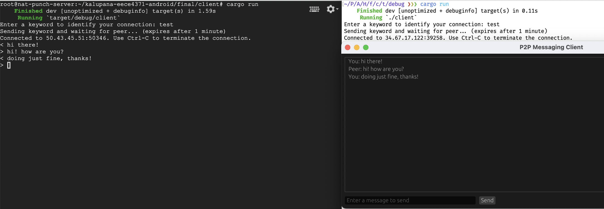

# P2P Messaging Client (using NAT Hole Punching)



This project is a basic P2P messaging client that utilizes NAT hole punching. It has two parts:

- `server/`: used for initial connection and to exchange NAT IP & port. Deployed using Terraform code in `server_deploy/`.
- `client/`: used for actually sending and receiving messages. Connects to server, then uses information to make P2P connection.


> NOTE: NAT hole punching doesn't work on all networks. [Before you use this, ensure that you have a 
permissive NAT that allows for hole punching.](https://clients.dh2i.com/NatTest/).

Two clients that use the same "keyword" can send messages between each other, as you'd expect from a standard messaging client.

## Installation & Running (Server)

In order to run the server, you'll need [Rust and Cargo installed](https://www.rust-lang.org/tools/install). To run, go into the server folder and run `cargo run --release`.

## Installation & Running (Client)

In order to run the client, you'll need [Rust and Cargo installed](https://www.rust-lang.org/tools/install).

For GUI support: on macOS and Windows, nothing extra is needed. However, on Linux, you'll need to run this:
```
# Distros that use apt
sudo apt install libxcb-render0-dev libxcb-shape0-dev libxcb-xfixes0-dev libspeechd-dev libxkbcommon-dev libssl-dev

# Fedora/Derivatives
dnf install clang clang-devel clang-tools-extra speech-dispatcher-devel libxkbcommon-devel pkg-config openssl-devel
```
If you can't install these, you can just run in console mode, as shown below.

To run, go into the client folder and run `cargo run --release`. If you don't have a display, console mode will automatically be launched; otherwise, a GUI will launch once a connection is established. If you'd like to use console mode directly, run `cargo build --release`, go into `target/release`, and run `./client --console`. 

